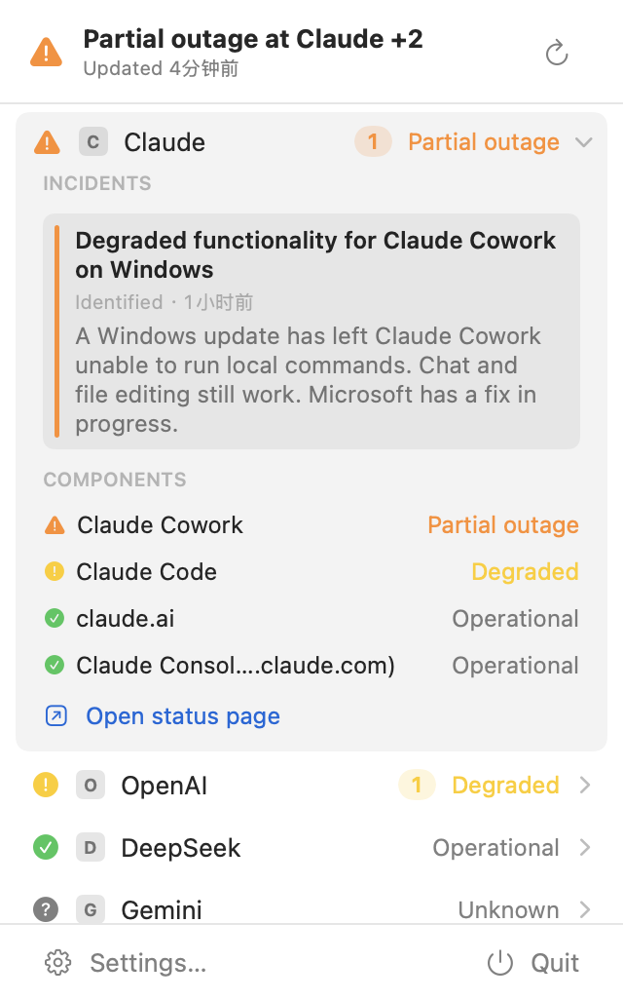
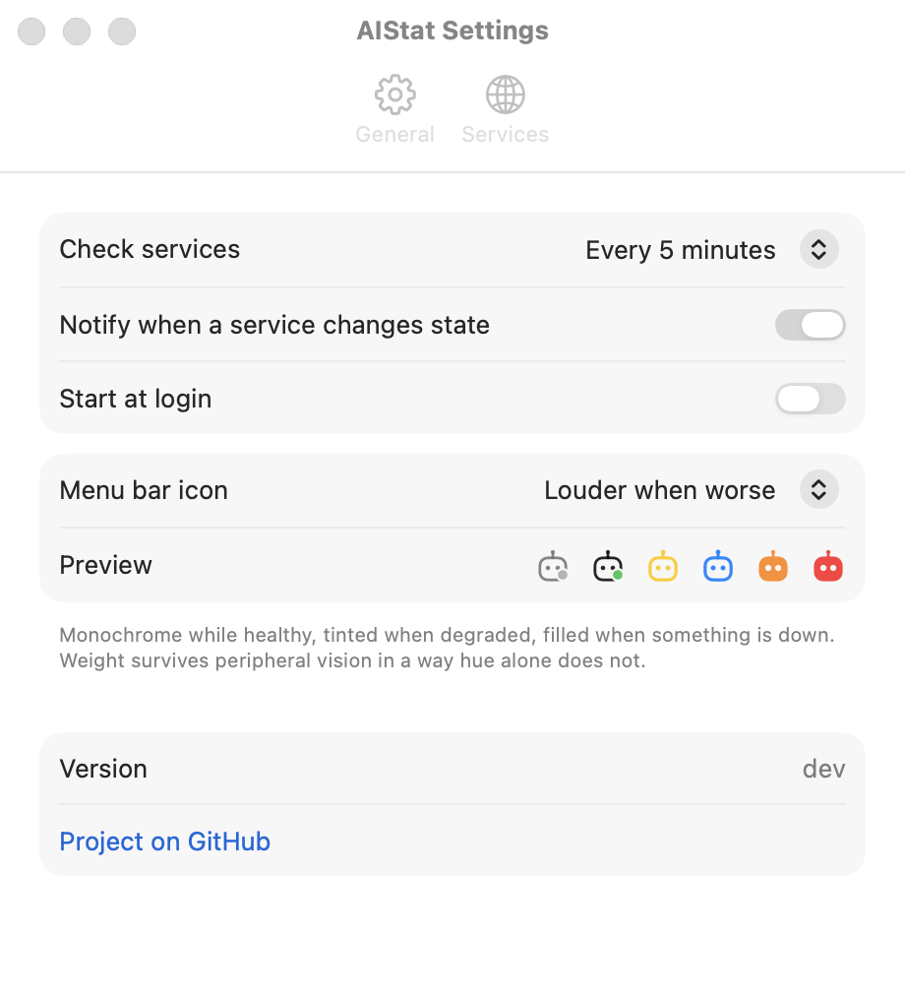
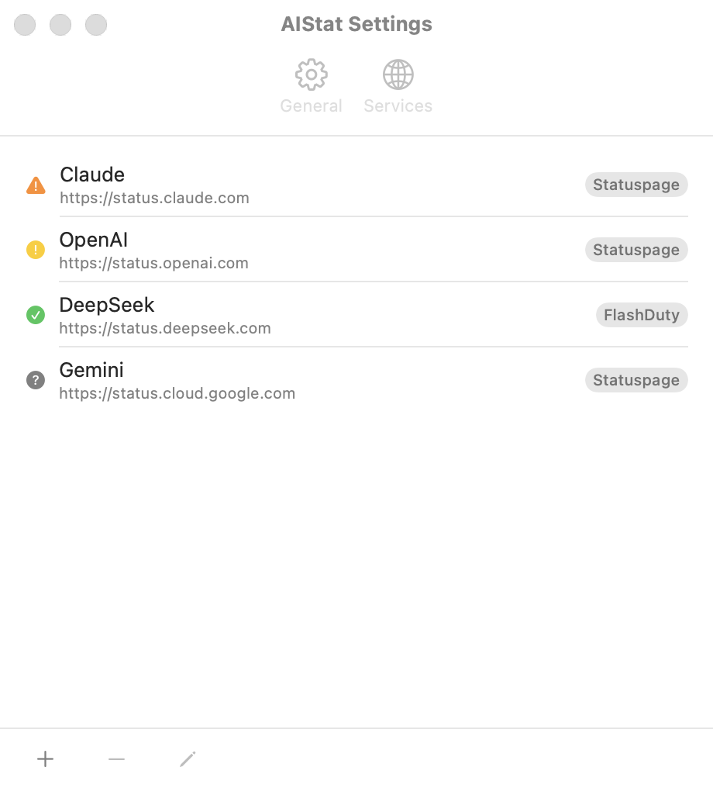
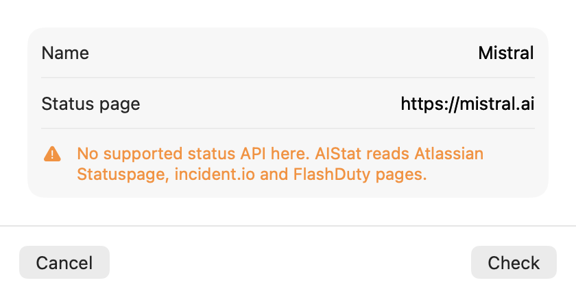
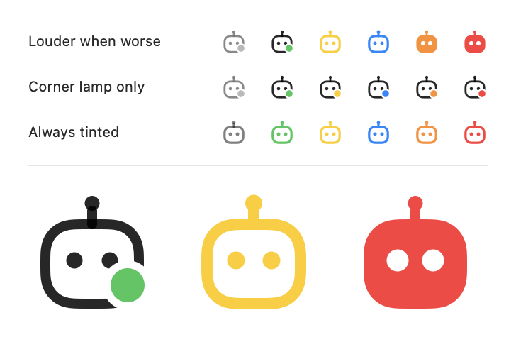

# The native macOS app

This is what macOS ships. `../src-tauri` + `../ui` is the same product for
Windows and Linux, built with Tauri; the two shells share no code.

The domain logic was carried over from `../crates/core` faithfully — the
provider mappings encode real upstream behaviour and are worth keeping exactly,
and `AGENTS.md` lists every Rust/Swift pair that has to change together. The
shell was not: most of it existed to make a webview behave like a menu bar
panel, and AppKit and SwiftUI already do that.

The root README covers installing and what the app does. This file covers what
the native platform let the design drop, and the two places where the obvious
SwiftUI answer turned out to be the wrong one.



## Build and run

Everything here runs from `macos/`.

```sh
swift test                            # 56 tests, no display needed
swift run aistat-smoke                # fetch the default services, print what came back
swift run aistat-preview docs/preview # render the UI offscreen to PNGs
UNIVERSAL=1 DMG=1 Scripts/bundle.sh   # what CI ships: universal .app + .dmg
open .build/bundle/AIStat.app
```

The version comes from `[workspace.package] version` in `../Cargo.toml` —
`bundle.sh` reads it and stamps `CFBundleShortVersionString`, and
`AIStatCore.version` reads that back. There is no copy of the number here to
fall out of step, so `../scripts/release.sh` needs no changes to cover macOS.

`swift run AIStat` works for a quick look, but three behaviours need a real
bundle around the binary and quietly do nothing without one: `LSUIElement`
(menu bar only, no Dock icon), `UNUserNotificationCenter` (refuses to post for
a process with no registered bundle identifier) and `SMAppService` (has nothing
to register as a login item). `Scripts/bundle.sh` builds that bundle.

Logs go to the unified log rather than stderr, because a menu bar app launched
from Finder has no terminal:

```sh
log stream --predicate 'subsystem == "com.aistat.app"' --level debug
```

## Layout

```
Sources/AIStatCore/     Providers, normalization, aggregation, snapshot diffing. No AppKit.
Sources/AIStatUI/       The app: SwiftUI views, the model, notifications, login item.
Sources/AIStatApp/      One line. Executable targets can't be imported by tests.
Sources/aistat-smoke/   Live fetch of the default services.
Sources/aistat-preview/ Offscreen renderer for the UI.
```

`AIStatCore` is deliberately AppKit-free, the way `../crates/core` is
Tauri-free: every mapping decision is unit-testable without a display.

## What the Tauri build does, and what changed here

### Kept, because it is the actual product

The status vocabulary, the four provider value-set mappings, and three rules
that are easy to get wrong and are each documented at the mapping:

- **Aggregation is always "worst wins", never "trust the provider."** A
  Statuspage page-level indicator is hand-maintained and lags — Anthropic's has
  read `minor` while four components reported a partial outage — so the overall
  status is the worst of the indicator, every non-group component, and any
  in-progress maintenance.
- **An open incident with `impact: none` is unclassified, not resolved.** It
  maps to Unknown, never to Operational.
- **An unrecognized value is Unknown**, never guessed into Operational.

Also kept: per-service failures become an Unknown row carrying the error text
instead of failing the batch; the adapter is detected from the URL so the user
never has to know what a status page is built on; service icons are scraped
from each page's `<link rel=icon>` and cached, with "checked, has none"
recorded so the HTML isn't refetched every poll.

The config file is byte-compatible, which is what makes the macOS switch
invisible: `~/Library/Application Support/com.aistat.app/config.json` written by
the Tauri build loads here unchanged, the bundle identifier is the same, and
`readsAConfigWrittenByTheRustBuild` in `Tests/AIStatCoreTests/ConfigTests.swift`
pins it.

### Deleted, because the platform already does it

| The original needed | Native answer |
|---|---|
| `rustls-graviola`, pinned so X25519MLKEM768 is offered *first* — `status.deepseek.com` sits behind a middlebox that resets any ClientHello fitting in one TCP segment, and the ~1.2KB post-quantum key share is what pushes it past | `URLSession`. Apple's TLS stack offers the hybrid group by default; measured 149 ms to a 200 against the same host |
| A **second**, zero-length `NSStatusItem` observed with KVO, because Tauri doesn't expose its status item and the *menu bar's* appearance is not the system appearance (a Light Mac with a dark wallpaper gets a dark bar) | The status item is ours, so its button answers directly. The probe is gone; the KVO stays, because nothing else reports a wallpaper change |
| `TrayAnchor` tracking, `panel_origin` geometry and `monitor_containing`, working around Tauri reporting monitor coordinates in two different units | `NSPopover` anchored to the status item button |
| A `ResizeObserver` measuring the list, an IPC call carrying the height to Rust, and a clamp there that resized and re-anchored the window | `NSHostingController(sizingOptions: .preferredContentSize)`, which republishes SwiftUI's ideal size for `NSPopover` to follow, over a `ScrollView` capped with `maxHeight` |
| — | The 250 ms reopen debounce **stays**. A click on the status item while the panel is open closes it first and then arrives at the button, which would re-open it. That is a property of menu bar panels, not of the framework underneath them |
| A `pinned` flag, dirty tracking, and a `blur` handler coordinating them — so a stray click couldn't dismiss the panel and discard a half-typed settings form | Settings moved into a window of its own. A window can't be dismissed by clicking elsewhere, so there is nothing to protect |
| `claim_notification_identity`, spending `notify-rust`'s one-shot `Once` before it could run an AppleScript lookup that opens the "Choose Application" picker in the user's face at the moment a service went down | `UNUserNotificationCenter`, which takes its identity from the bundle |
| An SDF rasterised with 4×4 supersampling into a 36×36 RGBA buffer, and two hand-tuned six-colour palettes because CSS cannot say "the system's green" | `Canvas` paths, resolution-independent, over the system colours |
| A hand-written `<link rel=icon>` scanner | Kept, and ported. `XMLParser` refuses real-world status pages and an HTML parser would be the package's only dependency, for one attribute on one tag |
| Custom dialog, switch, stepper, empty state, buttons, scroll containers | `.alert`, `Toggle`, `Picker`, `ContentUnavailableView`, `Link`, `ScrollView` |

### Changed, as judgement calls

- **Shape carries the status, not only hue.** The original distinguished six
  states by colour alone — the one encoding that disappears for a red/green
  colour-blind user, and the first to go in peripheral vision. Each state now
  gets an SF Symbol whose silhouette is unambiguous without any colour; the
  colour reinforces it.
- **The refresh interval is a `Picker` of presets, not a free seconds field.**
  The old field accepted anything and was clamped to 30 s behind the user's
  back. A config file holding some other number still shows it, selectable.
- **Adapter detection happens in the add/edit sheet**, as soon as the URL is
  committed, with the answer shown in place. The original deferred the same
  probe to the moment you pressed Save and reported failure in a modal alert —
  so you found out a page was unreadable only after deciding you were done.
- **Settings apply as they are made.** Save/Cancel existed because settings
  lived in a panel that could vanish mid-edit.
- **The tray's right-click menu became two buttons in the panel.** A menu you
  have to know to right-click for is a menu most people never find.
- **Start at login works.** The original carried a `launch_at_login` field in
  its config that nothing ever read.

### Given up

**Windows and Linux.** The original ships five targets; this ships one. That is
the whole cost of the trade, and it is not recoverable — `NSStatusItem`,
`NSPopover`, `SMAppService`, `UNUserNotificationCenter` and the SF Symbols
vocabulary are all Apple-only. The `AIStatCore` target is pure Foundation and would port, but the
app around it would have to be rewritten again per platform. If cross-platform
is the requirement, the Tauri build is the right answer and this one is not.

### `MenuBarExtra`, and why it isn't used

The obvious SwiftUI answer to a menu bar app is `MenuBarExtra`, and the first
version of this rewrite used it. It does not work for this app, for a reason
worth writing down: the `label:` closure only renders `Text` and `Image`. Given
the `Canvas` that draws this app's mark it produced a status item **4 points
wide** — inserted, sized to nothing, invisible in the bar. The same binary with
`MenuBarExtra("AIStat", systemImage:)` got 19 points, and the `NSStatusItem` it
now uses gets 22.

A custom-drawn menu bar icon is not something that initializer can express, so
the item is AppKit's and the panel is an `NSPopover`. Everything inside both is
still SwiftUI. The `Settings` scene is unaffected and is still the reason a
whole layer of the original — the pin flag, the dirty tracking, the blur
handler — is gone.

Two consequences, both traced back to this app having no main menu because it
is an accessory:

* `SettingsLink` reads its action out of the *scene* environment, and the panel
  is hosted in a popover built by hand, which has no scene above it — the link
  rendered and did nothing.
* `NSApp.sendAction(Selector(("showSettingsWindow:")))`, the usual fallback, is
  answered by the app menu's Settings item. With no main menu there is no
  responder and the action goes nowhere.

So the settings window is owned outright too (`SettingsWindowController`). What
mattered about the `Settings` scene — that settings live in a window rather than
inside the panel — is unchanged.

## Testing

56 tests, none of which need a display.

`AIStatCoreTests` carries the original's provider, normalization, aggregation,
snapshot and icon-scraper tests across, because they encode upstream API
behaviour rather than implementation detail. `AIStatUITests` covers the panel's
headline logic and the service-list editing rules — notably that renaming a
service keeps its id, since the id is what the snapshot diff matches on and a
rename must not read as "every incident this service has is new".

`swift run aistat-smoke` is the live check: unit tests pin the mappings, but
only a real fetch says whether the pages still answer the shape they assume.

## The preview renderer

`swift run aistat-preview` hosts each view in an off-screen window and captures
what AppKit draws, so a layout change can be reviewed without launching a menu
bar app and photographing it. Output lands in `docs/preview/`.

Deliberately not `ImageRenderer`: `Form`, `List`, `Menu` and `Link` are
AppKit-backed on macOS, and `ImageRenderer` draws a placeholder where it meets
one — the settings window came back as a single "unavailable" glyph.

The settings window is captured whole, title bar and toolbar included, by
drawing its frame view rather than its content view. Its pane switcher is an
`NSToolbar`, so a content-only render would have missed it — which is how the
`TabView` it replaced survived long enough to ship a stray rule across the
window.

| | |
|---|---|
|  |  |
|  |  |
